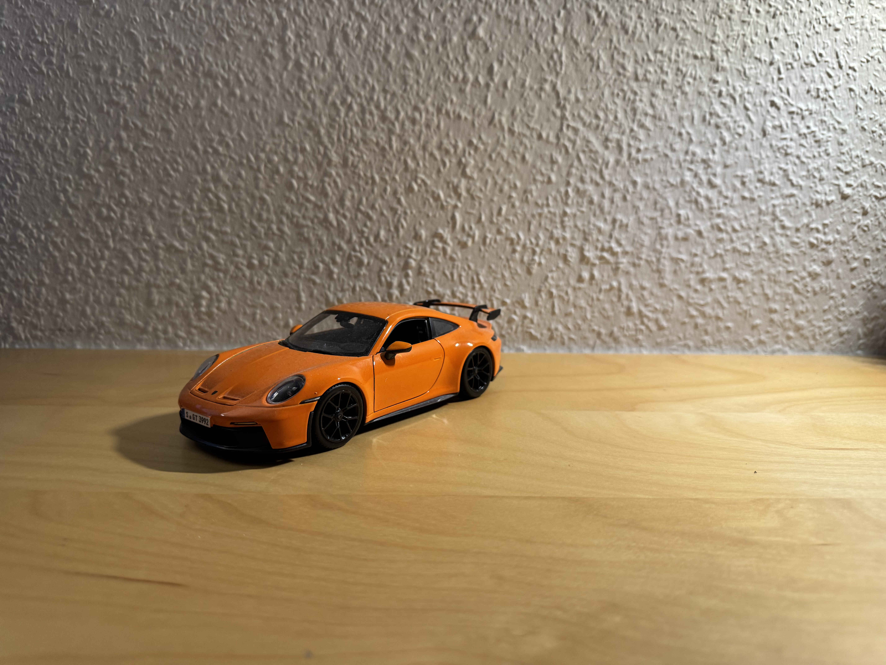
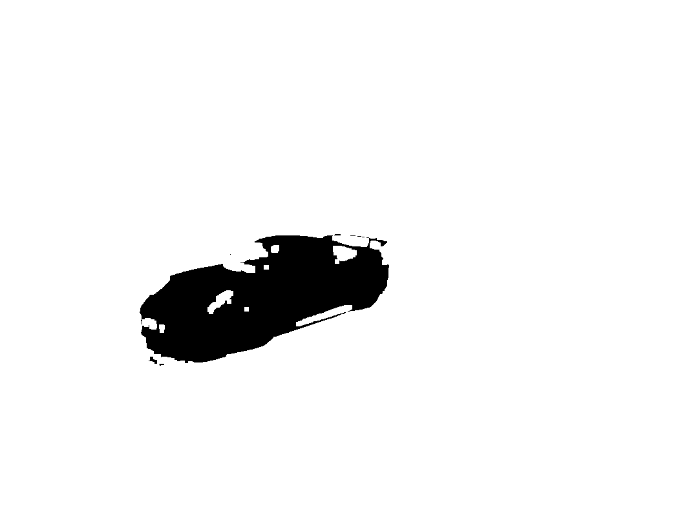

# Foreground/Background Separation Using Mixture of Gaussians (MoG)

## Motivation  
As part of the *Machine Learning* lecture at RWTH Aachen University, we were introduced to the Mixture of Gaussians (MoG) algorithm.  

To deepen my understanding of this algorithm, I decided to implement a foreground/background segmentation method using MoG on my own images.  

## Repository Overview  
The repository is organized as follows:  
- `./scripts/` – Contains all the scripts developed for this project.  
- `./input_images/` – Stores test images used in the pipeline.  
- `./output_images/` – Contains the results generated by the algorithm.  

## How to Test the Algorithm  
Ensure you have the required packages installed. Then, using VSCode, run the task `main`.  

A window will open, prompting you to define regions for the foreground and background. You can do this easily by following the on-screen instructions at the top of the window.  

An example is shown below:  

  

Here, the green boxes represent the foreground, while the red boxes indicate the background.  

### Labeling Window Shortcuts  
- **`f`** – Sets bounding box mode to *foreground*  
- **`b`** – Sets bounding box mode to *background*  
- **`u`** – Undoes the last drawn bounding box  
- **`c`** – Clears all bounding boxes  

Once you’ve finished labeling, simply close the window and let the algorithm run. When processing is complete, you'll receive a notification in the terminal, and the generated images will be saved as output.  

Below are examples of an input image and the corresponding segmented output:  

  
  
